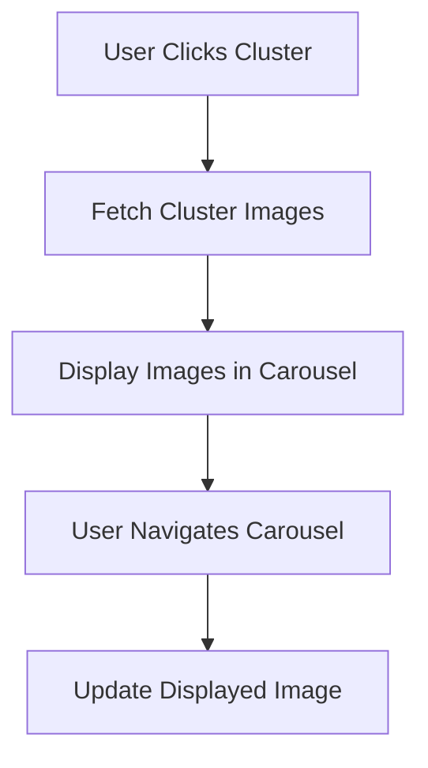

# Feature Design: Cluster Images in Info Panel

## Overview
This document outlines the design for enhancing the cluster info panel by displaying images from the cluster. The feature will provide a visual representation of the cluster's contents, improving user experience and understanding of the data.

## Current Implementation Analysis

### Info Panel
- Located in `static/index.html` (lines 78-81)
- Displays cluster information when a cluster is clicked
- Current content: Cluster ID, size, and label
- Triggered by cluster click event in `static/app.js` (lines 184-191)

### Data Flow
1. User clicks a cluster polygon on the map
2. `prioritizeCluster()` function is called (line 225-230)
3. Cluster info is displayed in the `#cluster-info` div (lines 186-191)
4. WebSocket connection sends prioritization request to server
5. Server processes label and sends updates via WebSocket

### Image Data Availability
- The dataset contains image URLs in the `url` column (inferred from typical image datasets)
- Cluster data is stored in `app_state.current_clusters` in `server.py`
- Each cluster entry contains `sample_ids` which can be used to fetch specific images

## Design Decisions

### UI/UX Design
- **Format**: Carousel/slider for displaying images
- **Images per view**: 1 image at a time
- **Navigation**: Previous/Next buttons for carousel navigation
- **Thumbnail preview**: Optional thumbnails below the main image
- **Image size**: Medium-sized images (e.g., 400x300 pixels) to fit within the sidebar

### Data Integration
- **Image selection**: Fetch 5-10 representative images from each cluster
- **Image source**: Use URLs from the dataset's `url` column
- **Caching**: Implement client-side caching to avoid repeated fetches
- **Fallback**: Display placeholder if image fails to load

### Backend Changes
- **API endpoint**: Add `/api/cluster_images` endpoint to fetch images for a specific cluster
- **Data structure**: Return array of image URLs for the cluster
- **Integration**: Modify clustering logic to store image URLs in cluster metadata

### Frontend Changes
- **HTML**: Add carousel container to cluster info panel
- **CSS**: Style the carousel and navigation buttons
- **JavaScript**: Implement carousel functionality and image fetching

## Implementation Plan

### Step 1: Backend Implementation
1. **Modify clustering logic** in `server.py`:
   - Update `app_state.current_clusters` to include image URLs
   - Store image URLs during cluster processing (around line 343-349)

2. **Add API endpoint** in `server.py`:
   - Create `/api/cluster_images` endpoint
   - Return image URLs for a given cluster ID
   - Implement caching mechanism

### Step 2: Frontend Implementation
1. **Update HTML** in `static/index.html`:
   - Add carousel container within `#cluster-info` div
   - Include navigation buttons and thumbnail container

2. **Update CSS** in `static/style.css`:
   - Style carousel container and images
   - Style navigation buttons and thumbnails
   - Ensure responsive design

3. **Update JavaScript** in `static/app.js`:
   - Add function to fetch cluster images
   - Implement carousel navigation logic
   - Update cluster info display to include images

### Step 3: Integration
1. **Connect frontend to backend**:
   - Call `/api/cluster_images` when cluster is clicked
   - Display images in carousel

2. **Testing**:
   - Verify image display functionality
   - Test carousel navigation
   - Ensure responsive design works

## Technical Specifications

### Backend API
```python
@app.get("/api/cluster_images")
async def get_cluster_images(cluster_id: str):
    """Return image URLs for a specific cluster"""
    cluster_data = app_state.current_clusters.get(cluster_id)
    if not cluster_data or "image_urls" not in cluster_data:
        return {"images": []}
    
    return {"images": cluster_data["image_urls"]}
```

### Frontend Carousel
```javascript
function initCarousel(clusterId) {
    fetch(`/api/cluster_images?cluster_id=${clusterId}`)
        .then(response => response.json())
        .then(data => {
            // Initialize carousel with image URLs
            displayImages(data.images);
        });
}

function displayImages(images) {
    const carousel = document.getElementById('cluster-carousel');
    // Populate carousel with images
    // Add navigation event listeners
}
```

### HTML Structure
```html
<div id="cluster-info">
    <h3>Cluster <span id="cluster-id"></span></h3>
    <p>Size: <span id="cluster-size"></span> points</p>
    <p>Label: <strong id="cluster-label">Loading...</strong></p>
    
    <div class="carousel-container">
        <div id="cluster-carousel" class="carousel">
            
        </div>
        <button id="prev-btn" class="carousel-btn">Previous</button>
        <button id="next-btn" class="carousel-btn">Next</button>
        <div id="thumbnail-container" class="thumbnails"></div>
    </div>
</div>
```

## Mermaid Diagram



## Success Criteria

1. Images are displayed in the cluster info panel when a cluster is clicked
2. Carousel navigation works smoothly
3. Images load quickly and display properly
4. The feature integrates seamlessly with existing functionality
5. The design is responsive and works on different screen sizes

## Open Questions

1. Should we implement lazy loading for images?
2. What should be the maximum number of images to display?
3. Should we include image captions or metadata?
4. How should we handle clusters with no images?

## Next Steps

1. Implement backend API endpoint
2. Update clustering logic to include image URLs
3. Design and implement frontend carousel
4. Test and refine the implementation
5. Document the feature for users