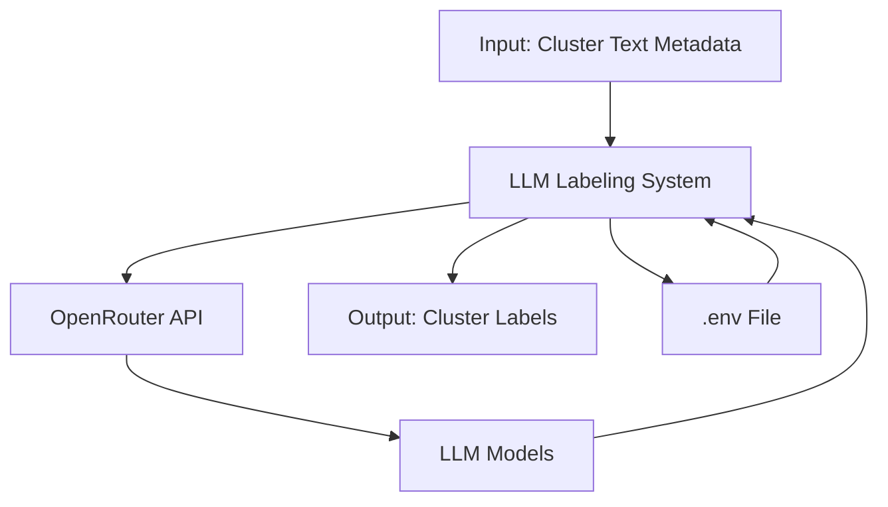
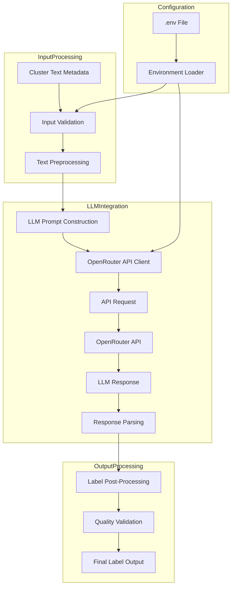

# LLM Labeling System - Technical Architecture

## System Overview

The LLM Labeling System is designed to automatically generate descriptive labels for image clusters using Large Language Models accessed through the OpenRouter API. The system takes text metadata from image clusters as input and returns appropriate, human-readable labels.

## Requirements Analysis

### Functional Requirements
1. **LLM Integration**: Use OpenRouter API for accessing various LLM models
2. **Environment Configuration**: Store API keys securely in a .env file
3. **Input Processing**: Accept text metadata from image clusters
4. **Label Generation**: Return appropriate descriptive labels for clusters
5. **Implementation**: Python implementation in `llm_labelling.py`

### Non-Functional Requirements
- **Security**: Secure API key management
- **Error Handling**: Robust error handling for API failures and invalid inputs
- **Extensibility**: Support for multiple LLM models and providers
- **Performance**: Efficient processing of cluster metadata

## System Architecture

### Component Diagram



### Data Flow Diagram



## Technical Specification

### Required Dependencies

```python
# Add to requirements.txt
python-dotenv>=1.0.0
requests>=2.31.0
tenacity>=8.2.0
pydantic>=2.0.0
```

### Core Components

#### 1. Environment Configuration

```python
# .env file structure
OPENROUTER_API_KEY="your_api_key_here"
DEFAULT_LLM_MODEL="mistralai/mistral-7b-instruct"
API_TIMEOUT=30
MAX_RETRIES=3
```

#### 2. Main Function Signatures

```python
def initialize_llm_client(api_key: str, model: str = None, timeout: int = 30) -> LLMClient:
    """
    Initialize the LLM client with OpenRouter API configuration.
    
    Args:
        api_key: OpenRouter API key
        model: LLM model identifier (e.g., 'mistralai/mistral-7b-instruct')
        timeout: API request timeout in seconds
        
    Returns:
        Configured LLMClient instance
        
    Raises:
        ValueError: If api_key is invalid or empty
        ConnectionError: If unable to establish connection
    """


def generate_cluster_label(cluster_metadata: dict, llm_client: LLMClient, max_tokens: int = 100) -> dict:
    """
    Generate a descriptive label for a cluster using LLM.
    
    Args:
        cluster_metadata: Dictionary containing cluster text metadata
        llm_client: Configured LLMClient instance
        max_tokens: Maximum tokens for LLM response
        
    Returns:
        Dictionary containing:
        - 'label': Generated label string
        - 'confidence': Confidence score (0-1)
        - 'metadata': Additional processing info
        
    Raises:
        LLMError: If LLM processing fails
        ValidationError: If input metadata is invalid
    """


def validate_input_metadata(metadata: dict) -> bool:
    """
    Validate cluster metadata structure and content.
    
    Args:
        metadata: Input metadata dictionary
        
    Returns:
        True if metadata is valid, False otherwise
        
    Raises:
        ValidationError: If metadata structure is invalid
    """


def construct_llm_prompt(metadata: dict, task_description: str = None) -> str:
    """
    Construct an optimized prompt for LLM labeling.
    
    Args:
        metadata: Cluster metadata
        task_description: Optional task-specific description
        
    Returns:
        Formatted prompt string for LLM
    """


def post_process_label(raw_label: str, metadata: dict) -> str:
    """
    Post-process and refine the raw LLM output.
    
    Args:
        raw_label: Raw label from LLM
        metadata: Original cluster metadata
        
    Returns:
        Refined label string
    """


def main_llm_labelling_workflow(cluster_metadata: dict, env_path: str = '.env') -> dict:
    """
    Main workflow for LLM-based cluster labeling.
    
    Args:
        cluster_metadata: Dictionary containing cluster text metadata
        env_path: Path to .env file
        
    Returns:
        Dictionary containing:
        - 'label': Final generated label
        - 'confidence': Confidence score
        - 'processing_info': Detailed processing information
        - 'timing': Performance metrics
        
    Raises:
        LLMWorkflowError: If any step in workflow fails
    """
```

### Data Structures

#### Input Data Structure

```python
class ClusterMetadata(BaseModel):
    cluster_id: str
    image_ids: List[str]
    text_metadata: List[str]  # Combined text from tags, titles, etc.
    cluster_size: int
    spatial_info: Optional[dict] = None  # Optional spatial characteristics
    
    class Config:
        schema_extra = {
            "example": {
                "cluster_id": "cluster_001",
                "image_ids": ["img_001", "img_002", "img_003"],
                "text_metadata": [
                    "paris eiffel tower landmark",
                    "eiffel tower night lights",
                    "paris cityscape with eiffel"
                ],
                "cluster_size": 3,
                "spatial_info": {
                    "centroid": [48.8584, 2.2945],
                    "bounding_box": [[48.85, 2.29], [48.86, 2.30]]
                }
            }
        }
```

#### Output Data Structure

```python
class LabelResult(BaseModel):
    label: str
    confidence: float
    processing_info: dict
    timing: dict
    
    class Config:
        schema_extra = {
            "example": {
                "label": "Eiffel Tower Paris Landmark",
                "confidence": 0.95,
                "processing_info": {
                    "model_used": "mistralai/mistral-7b-instruct",
                    "prompt_tokens": 45,
                    "completion_tokens": 12,
                    "total_tokens": 57
                },
                "timing": {
                    "total_processing_time": 1.23,
                    "llm_response_time": 0.87
                }
            }
        }
```

## Error Handling Strategy

### Error Classification

1. **Configuration Errors**: Missing or invalid .env file, API key issues
2. **Input Validation Errors**: Invalid metadata structure or content
3. **API Communication Errors**: Network issues, timeouts, rate limiting
4. **LLM Processing Errors**: Model failures, invalid responses
5. **Post-processing Errors**: Label formatting issues

### Error Handling Implementation

```python
class LLMError(Exception):
    """Base class for LLM-related errors"""
    pass


class ConfigurationError(LLMError):
    """Errors related to system configuration"""
    pass


class InputValidationError(LLMError):
    """Errors related to input data validation"""
    pass


class APICommunicationError(LLMError):
    """Errors related to API communication"""
    pass


class LLMProcessingError(LLMError):
    """Errors related to LLM processing"""
    pass


class PostProcessingError(LLMError):
    """Errors related to label post-processing"""
    pass


def handle_error(error: Exception, context: dict = None) -> dict:
    """
    Centralized error handling function.
    
    Args:
        error: Exception to handle
        context: Additional context for error handling
        
    Returns:
        Dictionary containing error information and recovery suggestions
    """
    error_info = {
        'error_type': type(error).__name__,
        'error_message': str(error),
        'timestamp': datetime.now().isoformat(),
        'context': context or {}
    }
    
    # Add specific handling for different error types
    if isinstance(error, ConfigurationError):
        error_info['recovery_suggestion'] = "Check .env file and API key configuration"
        error_info['severity'] = "HIGH"
    
    elif isinstance(error, InputValidationError):
        error_info['recovery_suggestion'] = "Validate input metadata structure and content"
        error_info['severity'] = "MEDIUM"
    
    elif isinstance(error, APICommunicationError):
        error_info['recovery_suggestion'] = "Check network connection and retry with exponential backoff"
        error_info['severity'] = "HIGH"
    
    elif isinstance(error, LLMProcessingError):
        error_info['recovery_suggestion'] = "Retry with different model or prompt formulation"
        error_info['severity'] = "MEDIUM"
    
    else:
        error_info['recovery_suggestion'] = "Unexpected error, check system logs"
        error_info['severity'] = "CRITICAL"
    
    return error_info
```

### Retry Mechanism

```python
from tenacity import retry, stop_after_attempt, wait_exponential, retry_if_exception_type

@retry(
    stop=stop_after_attempt(3),
    wait=wait_exponential(multiplier=1, min=4, max=10),
    retry=retry_if_exception_type((APICommunicationError, LLMProcessingError))
)
def call_llm_api_with_retry(prompt: str, client: LLMClient) -> str:
    """
    Call LLM API with exponential backoff retry mechanism.
    
    Args:
        prompt: Input prompt for LLM
        client: Configured LLM client
        
    Returns:
        LLM response string
        
    Raises:
        APICommunicationError: After all retry attempts fail
        LLMProcessingError: If LLM returns invalid response
    """
    try:
        response = client.generate(prompt)
        if not response or not response.strip():
            raise LLMProcessingError("Empty response from LLM")
        return response
    except requests.exceptions.RequestException as e:
        raise APICommunicationError(f"API communication failed: {str(e)}")
    except Exception as e:
        raise LLMProcessingError(f"LLM processing failed: {str(e)}")
```

## Security Considerations

### API Key Management

1. **Environment Variables**: Store API keys in .env file, never in code
2. **Git Ignore**: Ensure .env is in .gitignore
3. **Permissions**: Restrict file permissions on .env file
4. **Validation**: Validate API key format before use

```python
# .gitignore should include:
.env
*.env
.env*

# File permissions: chmod 600 .env
```

### Secure Implementation Practices

```python
def load_environment_variables(env_path: str = '.env') -> dict:
    """
    Securely load environment variables from .env file.
    
    Args:
        env_path: Path to .env file
        
    Returns:
        Dictionary of environment variables
        
    Raises:
        ConfigurationError: If .env file is missing or invalid
    """
    try:
        # Validate file exists and is readable
        if not os.path.exists(env_path):
            raise ConfigurationError(f"Environment file not found: {env_path}")
        
        if not os.access(env_path, os.R_OK):
            raise ConfigurationError(f"Cannot read environment file: {env_path}")
        
        # Load environment variables
        load_dotenv(env_path)
        
        # Validate required variables
        api_key = os.getenv('OPENROUTER_API_KEY')
        if not api_key or not api_key.strip():
            raise ConfigurationError("OPENROUTER_API_KEY not set or empty")
        
        # Validate API key format (basic check)
        if len(api_key.strip()) < 20:  # Reasonable minimum length
            raise ConfigurationError("OPENROUTER_API_KEY appears invalid")
        
        return {
            'api_key': api_key,
            'model': os.getenv('DEFAULT_LLM_MODEL', 'mistralai/mistral-7b-instruct'),
            'timeout': int(os.getenv('API_TIMEOUT', '30')),
            'max_retries': int(os.getenv('MAX_RETRIES', '3'))
        }
        
    except Exception as e:
        raise ConfigurationError(f"Failed to load environment: {str(e)}")
```

### Rate Limiting and API Security

1. **Request Throttling**: Implement rate limiting to prevent API abuse
2. **Timeout Management**: Set appropriate timeouts for API calls
3. **Input Sanitization**: Clean and validate all inputs to LLM
4. **Response Validation**: Validate LLM responses before processing

## Implementation Plan

### Phase 1: Setup and Configuration
1. Create .env file template
2. Update requirements.txt with dependencies
3. Implement environment loading and validation
4. Set up error handling framework

### Phase 2: Core Functionality
1. Implement LLM client wrapper
2. Develop prompt construction logic
3. Create input validation functions
4. Implement response parsing and post-processing

### Phase 3: Integration and Testing
1. Integrate with existing text mining workflow
2. Create unit tests for core functions
3. Implement performance monitoring
4. Add logging for debugging and auditing

### Phase 4: Optimization and Deployment
1. Add caching for frequent queries
2. Implement model selection logic
3. Add configuration for different use cases
4. Document usage and examples

## Performance Considerations

1. **Caching**: Cache frequent cluster patterns to reduce API calls
2. **Batching**: Support batch processing of multiple clusters
3. **Parallelization**: Process independent clusters in parallel
4. **Model Selection**: Choose appropriate model size based on cluster complexity

## Monitoring and Logging

```python
import logging
from datetime import datetime

# Configure logging
logging.basicConfig(
    level=logging.INFO,
    format='%(asctime)s - %(name)s - %(levelname)s - %(message)s',
    handlers=[
        logging.FileHandler('llm_labelling.log'),
        logging.StreamHandler()
    ]
)

logger = logging.getLogger('llm_labelling')

def log_llm_call(prompt: str, response: str, timing: dict, tokens: dict):
    """Log LLM API calls for monitoring and debugging"""
    logger.info(f"LLM Call - Tokens: {tokens}, Timing: {timing}")
    # Additional detailed logging as needed
```

## Integration with Existing System

The LLM labeling system will integrate with the existing text mining workflow:

1. **Input**: Receive cluster metadata from clustering.py
2. **Processing**: Use LLM to generate enhanced labels
3. **Output**: Provide labels that can be used in visualization and analysis
4. **Fallback**: Maintain existing TF-IDF and association rule methods as fallback

## Future Enhancements

1. **Multi-model Support**: Support multiple LLM providers
2. **Fine-tuning**: Allow model fine-tuning for specific domains
3. **Feedback Loop**: Incorporate user feedback to improve labels
4. **Cost Optimization**: Implement cost-aware model selection
5. **Batch Processing**: Support for large-scale cluster labeling

## Conclusion

This architecture provides a robust, secure, and extensible foundation for LLM-based cluster labeling. The system is designed to integrate seamlessly with the existing text mining infrastructure while providing enhanced labeling capabilities through large language models.